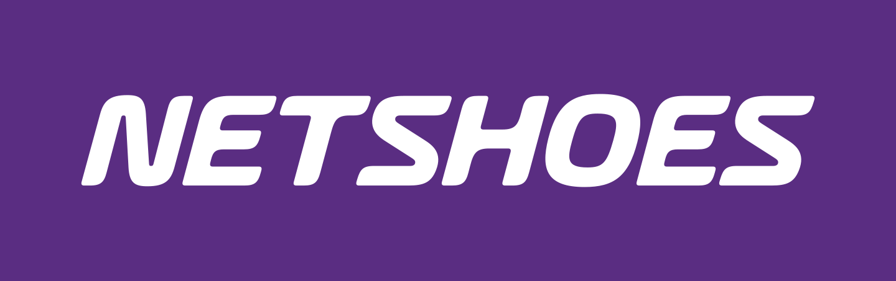
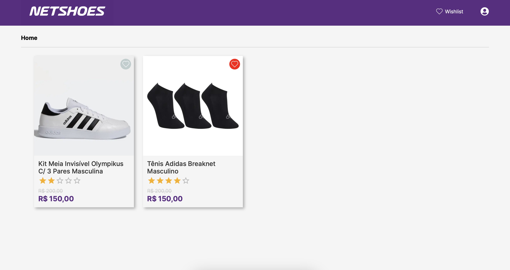
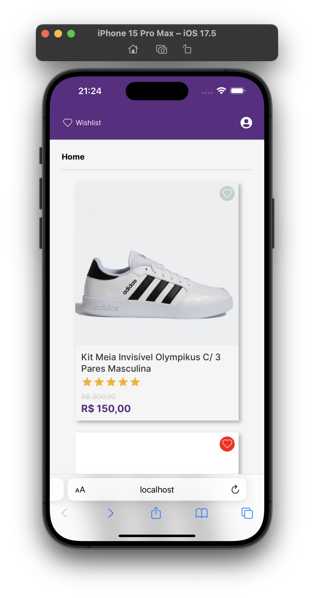

<div align="center">
  
  <h3>Projeto - NETSHOES</h3>
</div>


## DEMO
<div style="display:flex;justify-content:center;align-items:center">
    
    
</div>

## Tecnologias Utilizadas

- React
- Next.js
- Redux
- Axios
- Styled Components
- LocalStorage

## Configuração do Projeto

Para executar este projeto localmente, siga estas etapas:

1. Certifique-se de ter o Node.js e o npm instalados na sua máquina.

2. Clone este repositório:

    ```
    git clone https://github.com/hiagopsilva/netshoes-web.git
    ```

3. Navegue até o diretório do projeto:

    ```
    cd netshoes-web 
    ```

4. Instale as dependências:

    ```
    npm install

    ou 

    yarn 
    ```

5. Inicie o servidor de desenvolvimento:

    ```
    npm run dev

    ou 

    yarn dev
    ```

6. Abra seu navegador e acesse [http://localhost:3000](http://localhost:3000) para ver o projeto em execução.

## Funcionalidades

O projeto tem as seguintes funcionalidades:

- Listagem de produtos
- Listagem de favoritos
- Opção de favoritar/desfavoritar o produto
- Layout Responsivo
- Persistencia de dados com Redux e/ou localStorage.
- Integrado com o backend.

## Licença

Este projeto está licenciado sob a [MIT License](https://opensource.org/licenses/MIT).
